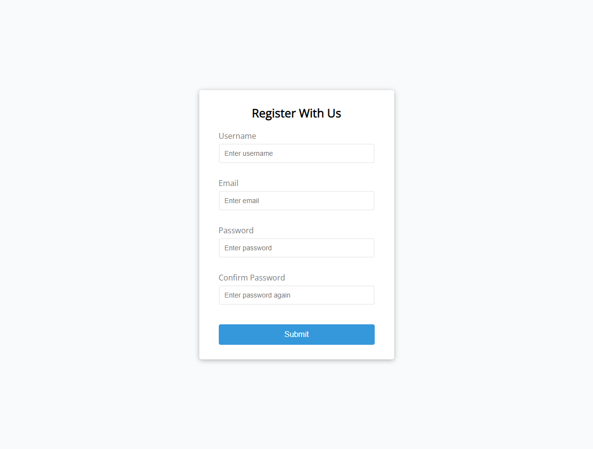
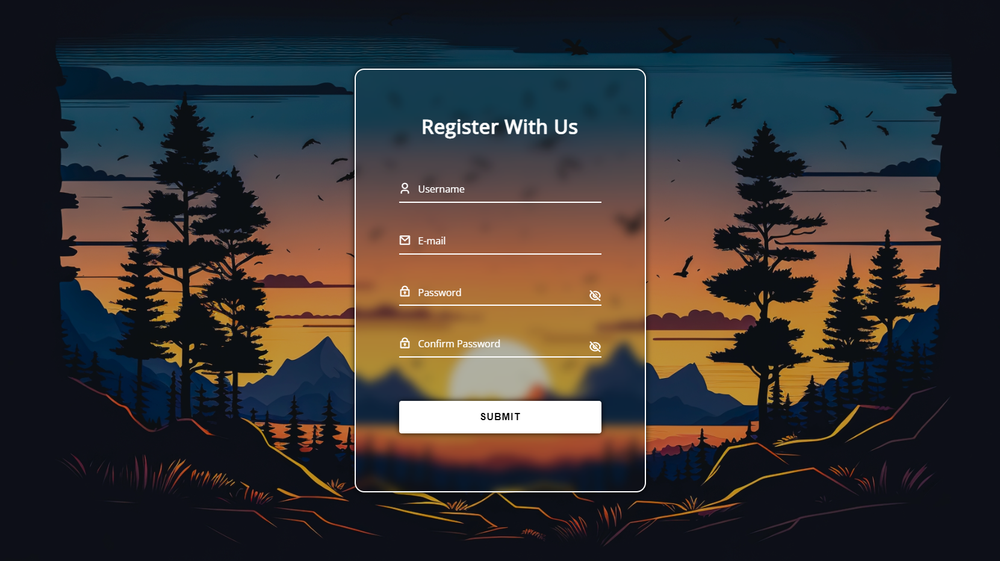

# Udemy--vanillawebprojects-01
**The first** of a series of **20 small projects** in **Vanilla JavaScript** from the [**Udemy course**](https://www.udemy.com/course/web-projects-with-vanilla-javascript/) by author [Brad Traversy](https://www.traversymedia.com/) with this [Brad's original GitHub repository](https://github.com/bradtraversy/vanillawebprojects).

# 01: Form Validator | Intro Project

Simple client side form validation. Check **required**, **length**, **email** and **password match**

## Project Specifications
- Create form UI
- Show error messages under specific inputs
- checkRequired() to accept array of inputs
- checkLength() to check min and max length
- checkEmail() to validate email with regex
- checkPasswordsMatch() to match confirm password

## Original preview

## My solution preview

## My solution ACTIVE states preview

## My solution specifications
- Responsive design
- When user clicks to input, placeholder (label) moves up
- Button hover effect
- Password eye icon changes when text/password is visible

# Author
Website - [Petr Bednarski](https://github.com/pettik)  
Frontend Mentor - [@pettik](https://www.frontendmentor.io/profile/pettik)
